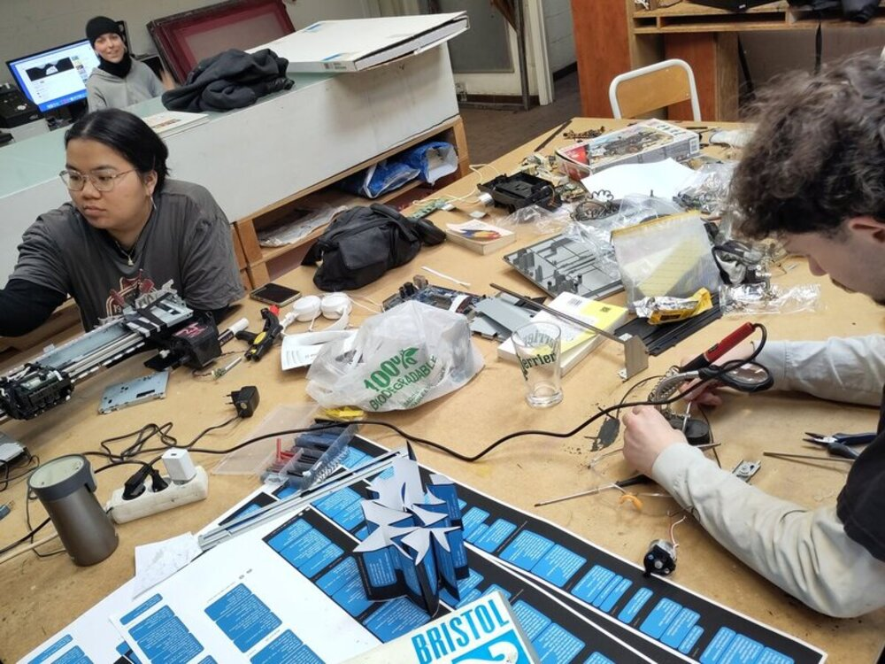
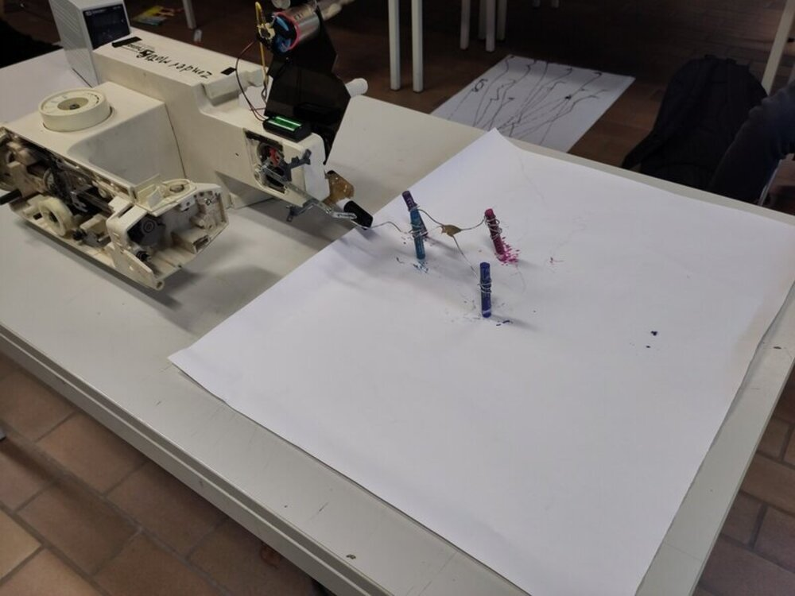
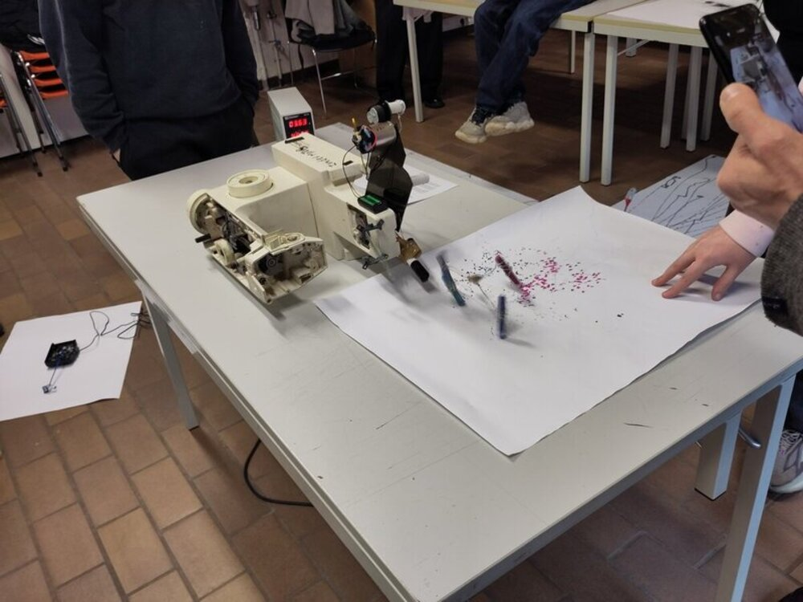

### Description

Each participant brings back at least one machine from their daily life, preferably one that is faulty or useless. Then
we take it apart and discover what's hidden inside: motors, cables, mechanisms and so on.

Once everything is dismantled, we reassemble and hybridize the machines together, creating machines that move, scream
and draw. Participants are invited to try out different drawing tools and different formats/supports to suit the needs
of their machines.

### Instructor

**Élie Bolard** is developing a practice centred on contemporary technologies, looking at how they work
and the monopoly of technical knowledge. His installations and sculptures are a blend of clumsy DIY and industrial
language. All these installations are motorised and intrinsically sonorous: the electronics are visible and the
mechanisms are audible. These machines echo a standardised world where gesture is omnipresent. Automation plays an
essential role in his work, both from a theoretical and critical point of view and from a visual point of view. These
machines, endowed with their own intelligence and reactions, lead the viewer to consider them as beings in their own
right. Everything is in motion, everything is alive, but the human being is no longer invited in, or is reduced to the
status of producer. 

* https://eliebolard.net/Machinedessiné-en/
* Facebook: https://www.facebook.com/events/1924856558450404

<video controls>
    <source src="/VID_408990209_205252_045.mp4" type="video/mp4" />
</video>

<video controls>
    <source src="/VID_408990211_035805_483.mp4" type="video/mp4" />
</video> 