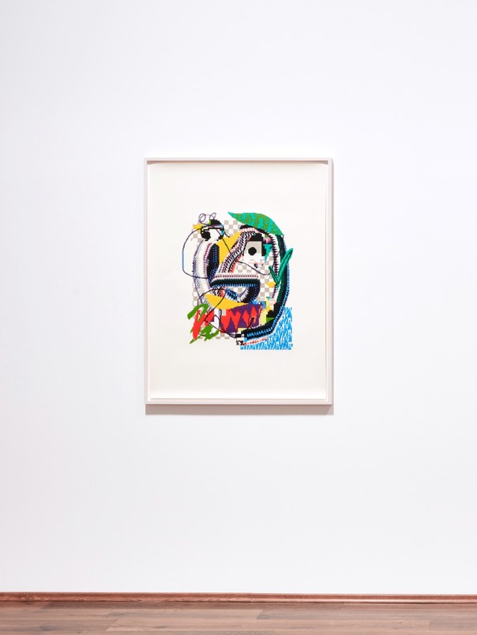
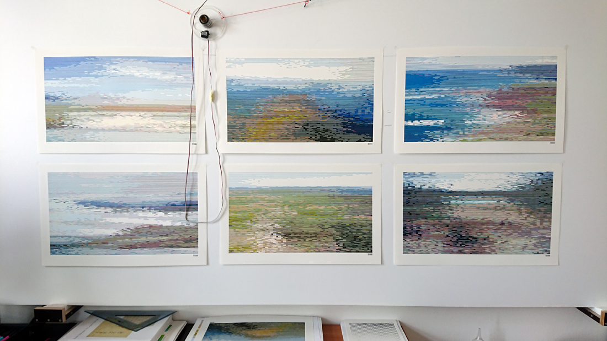
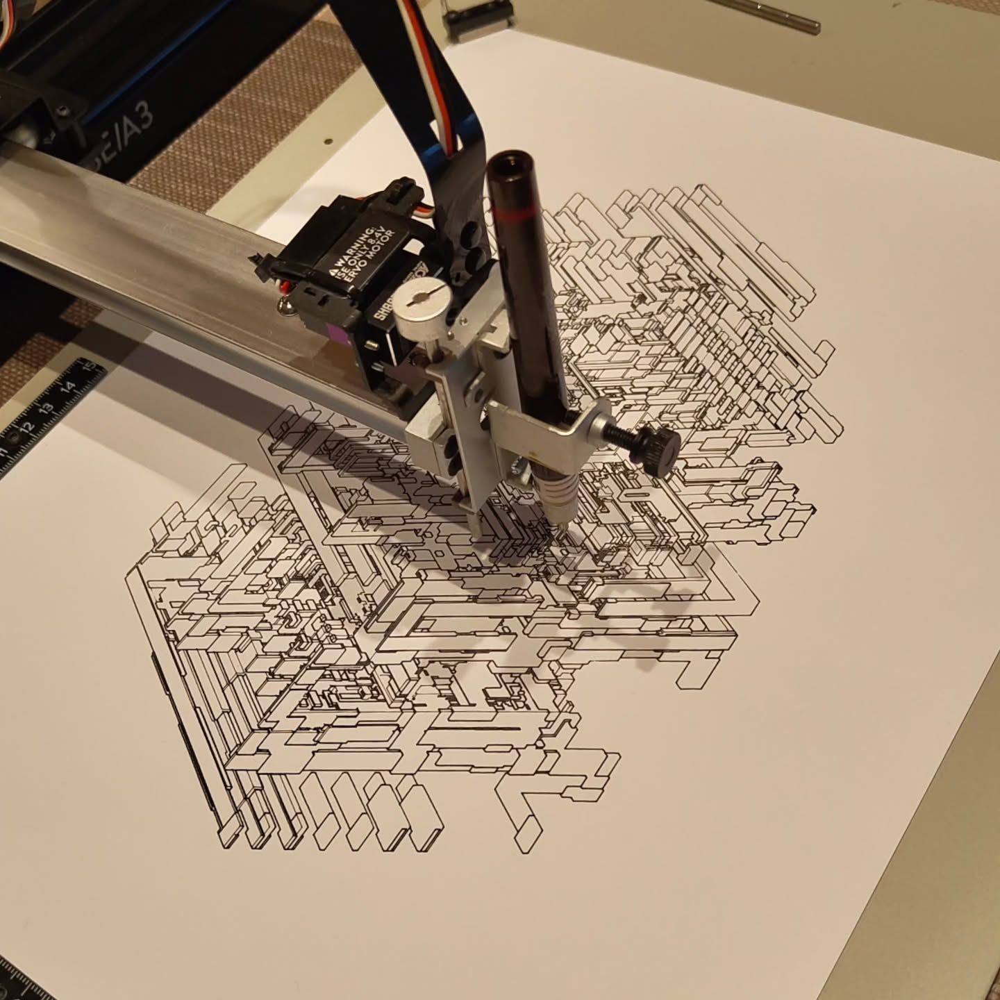
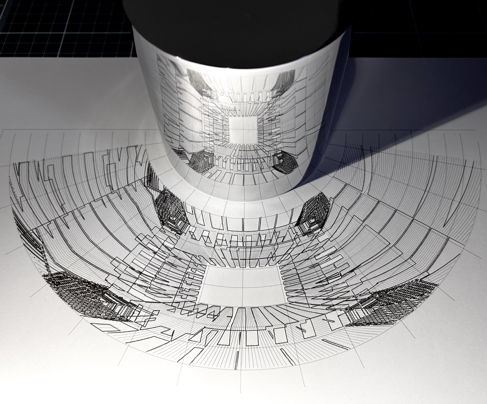
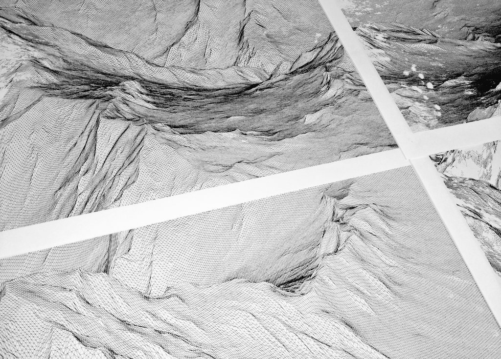
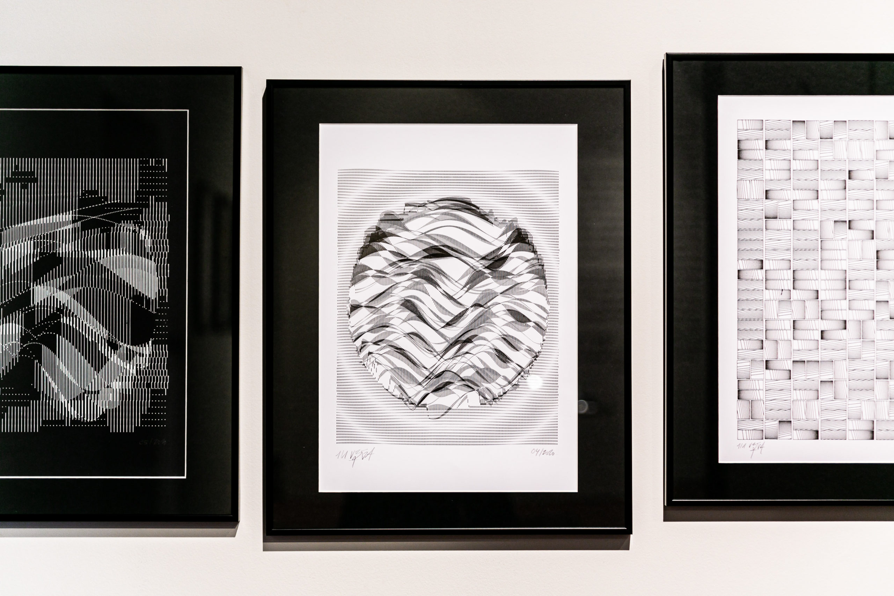

**Du 13 au 30 janvier, découvrez l’exposition DRAW() à la galerie Overflow !**

Dans les années 50, les premiers artistes computationnels utilisaient des machines à dessiner - ou pen plotters - pour
visualiser des oeuvres que les ordinateurs de l’époque ne pouvaient pas encore restituer sur écran.

60 ans plus tard, le progrès de l’informatique et la démocratisation de l’impression ont rendu ces machines lentes et
peu pratiques obsolètes. Mais elles ont trouvé une seconde vie dans les mains d’artistes numériques qui y voient une
manière de rendre leur travail souvent cantonné aux écrans plus tangible, plus émouvant, plus humain.

## En pratique

* Du 13/01 au 30/01/26
* Visites: du mardi au samedi entre 13h et 18h
* Entrée libre
* Vernissage: samedi 10 janvier à 18h30
* Adresse: Rue Hongrée 6B, 4000 Liège

## Exposition collective

A travers les oeuvres de 7 artistes belges et internationaux, l’exposition vous fera découvrir la pratique du generative
art (où l’oeuvre est générée par un système semi-autonome créé par l’artiste) et du pen plotter dans toute sa diversité,
tant en terme d’esthétique que de technique.

**Curation:** Jonathan Berger / Overflow \
_Avec le soutien de [Vetro Editions](https://vetroeditions.com/) et de l’Echevinat de la culture de la ville de Liège._

### Arno Beck (DE)

Les gravures et peintures conceptuelles d'Arno Beck s'articulent autour de l'esthétique numérique et se concentrent sur
la production analogique d'images numériques.
S'inspirant du langage de la culture numérique, les motifs sont basés sur des graphiques informatiques, des jeux et des
interfaces à basse résolution.
Il s'agit d'une interaction entre le monde contemporain des écrans numériques et les techniques traditionnelles.

https://arnobeck.de/

### Daniela Kröhnert (AT)

Daniela Kröhnert est chercheuse en architecture et artiste spécialisée dans la fabrication numérique.

Elle a étudié l'architecture à l'Institut de technologie de Karlsruhe en Allemagne (2004-2008) et a obtenu son diplôme
avec mention
à l'Université des arts appliqués de Vienne (Studio Prix) en 2011. De 2007 à 2014, elle a acquis un large éventail de
compétences
en travaillant avec Coop Himmelb(l)au sur des projets internationaux.

Elle enseigne la conception et la fabrication numériques depuis plus de dix ans à l'université technique de Nuremberg,
entre autres,
et actuellement à l'université des arts appliqués de Vienne, au département d'éducation artistique en design et
technologie/design, architecture et environnement, et à l'Institut d'architecture, en plus d'être responsable du
laboratoire de conception et de production numériques (ddplab) de ce dernier.
Elle a également été l'une des principales chercheuses du projet de recherche artistique Conceptual Joining - Wood
Structures from Detail to Utopia, financé par le Fonds autrichien pour la science (FWF), programme PEEK.

Son amour pour les technologies CNC et le flou entre les domaines numérique et physique s'étend à sa pratique
DARK,
où elle poursuit sa passion pour le dessin informatique et les machines à dessiner, en utilisant des traceurs HP des années
80 ainsi que
des machines qu'elle a elle-même construites.

https://www.iamdark.art/

### Frederik Vanhoutte (wblut) (BE)

Lorsque les gouttes de pluie frappent le pare-brise, il imagine des particules alpha traçant des chemins à travers les
cellules. Lorsqu'il tire le
bouchon de la baignoire, il observe le tourbillon qui se forme. À la table de la cuisine, il joue avec les verres, les
caustiques qu'ils créent. Lors d'un dîner aux chandelles, il se surprend à fixer la flamme. Parfois, tard dans la nuit,
il
s'assoit devant son ordinateur. Quand il finit par cligner des yeux, un enchevêtrement de code génère des structures
aléatoires
à l'écran. Il passe le reste de la nuit à les fixer.

Le jour, Frederik dirige le département de physique médicale d'un hôpital universitaire en Belgique, où il collabore
avec des
oncologues radiothérapeutes, des physiciens et des infirmières pour transformer des données médicales en traitements
contre le cancer qui sauvent des vies. La nuit, il est un
codeur créatif, à cheval entre l'art et la science, l'utilité et la beauté. Poussé par sa curiosité pour les
systèmes physiques, biologiques et informatiques, il construit des systèmes numériques de création.

https://winterbloed.be/

### Jessica In (UK)

En tant qu'architecte, designer et codeuse, Jessica met particulièrement l'accent sur le potentiel expressif du
code comme moyen d'explorer le design sur mesure. Les notions de code, de dessin, de beauté algorithmique et de
géométrie pour explorer les relations immatérielles et spatiales sont au cœur de son travail. Actuellement spécialisée
dans la représentation architecturale et l'apprentissage automatique, elle est doctorante à la _Bartlett School of
Architecture_, où elle est également chargée de cours et codirectrice du programme _MArch Design for Performance and
Interaction_.

https://www.jessicain.net/

### Studio Lemercier(BE)

**Co-dirigé par Juliette Bibasse et Joanie Lemercier**

Le Studio Lemercier est co-dirigé par l'artiste Joanie Lemercier et la commissaire indépendante Juliette Bibasse. Le duo
et leur équipe sont basés à Bruxelles, travaillant principalement autour de la projection de lumière dans l'espace. La
pratique du studio vise à s’échapper des écrans traditionnels en utilisant des surfaces non conventionnelles comme de
l’eau brumisée ou d’autres supports inhabituels. Une grande partie des projets est inspirée par la nature et questionne
la représentation du monde à travers du code, des mathématiques, des sciences et des technologies.

Cette fascination pour la nature va de pair avec l'implication personnelle de Joanie Lemercier en tant qu'activiste
environnemental, un
engagement qui nourrit à son tour le travail du studio. Au cours des 15 dernières années, Joanie Lemercier a développé
des stage design, des projections architecturales et des installations, collaborant avec des artistes tels que Jay-Z,
Flying Lotus et Adrian Utley de Portishead. La première grande exposition monographique du studio, intitulée "Paisajes
de Luz", a été commissionnée en 2021 par la Fundación Telefónica de Madrid et a depuis été exposée à Mexico, Lima,
Arequipa et plusieurs lieux en France. Le Studio Lemercier a participé à de nombreuses expositions collectives et
festivals dans le monde entier.

Juliette Bibasse a été productrice d'artistes pendant une dizaine d’année. Depuis 2018
elle est commissaire internationale invitée par plusieurs festivals (Eindhoven, Montréal, Barcelone,…). Depuis 2020,
elle dirige un festival de lumière à Louvain: (Un)Holy Light. En 2019, elle a co-fondé SALOON Brussels, un réseau
international de femmes travaillant dans l'art. Elle est une membre active des scènes artistiques numériques de Belgique
et de France.

https://joanielemercier.com/

### Julien Gachadoat (v3ga) (FR)

Julien Gachadoat (alias v3ga) explore le dessin génératif depuis de nombreuses années. Il a grandi dans les années 90 au
milieu de la
demo scene avant-gardiste, créant des visuels à partir de code. Depuis lors, les langages de programmation sont son
outil de création.

Créant des œuvres uniques à l'aide d'algorithmes, il travaille sur l'émergence de formes abstraites. Combinant des
formes géométriques monochromes,
il joue avec la répétition, utilisant des opérations aléatoires pour générer un élément de surprise. Julien Gachadoat
utilise l'
ordinateur - « cet interprète unique » (Vera Molnár) - pour développer ses propres outils créatifs basés sur des règles
graphiques simples, puis
explorer les possibilités formelles qui en découlent. En imprimant ces pièces uniques à l'aide d'un traceur, il crée un
lien
entre le texte et le code, entre l'ordinateur et le crayon, entre la rigueur du code et la poésie de l'art. « Laisser
une
empreinte unique, esthétiquement palpable, qui ne défie pas le numérique, mais au contraire le sert » : voici sa
philosophie.

https://www.v3ga.net/

<small><i>Credits: Benoît Cary</i></small>

### Matt Deslauriers (UK)

Matt DesLauriers est un artiste né au Canada qui vit actuellement au Royaume-Uni. Son travail se concentre sur
l'exploration ludique
du code en tant que moyen d'expression créatif, souvent guidée par des processus émergents, génératifs et
algorithmiques. Ses œuvres ont été
exposées à l'international, notamment à la _Somerset House_ à Londres, à _Paris Photo_ en France, à la _Kunsthalle
Zürich_ en
Suisse, au _MoCA Taipei_ à Taïwan et à _Art Basel_ à Miami et Hong Kong. Matt est actif au sein de la communauté open
source
et a donné de nombreuses conférences, cours et ateliers sur le codage créatif. Matt poursuit actuellement un doctorat à
l'UAL à Londres,
où il mène des recherches sur la couleur, la perception et l'apprentissage automatique dans le contexte de l'art
informatique.

https://www.mattdesl.com/